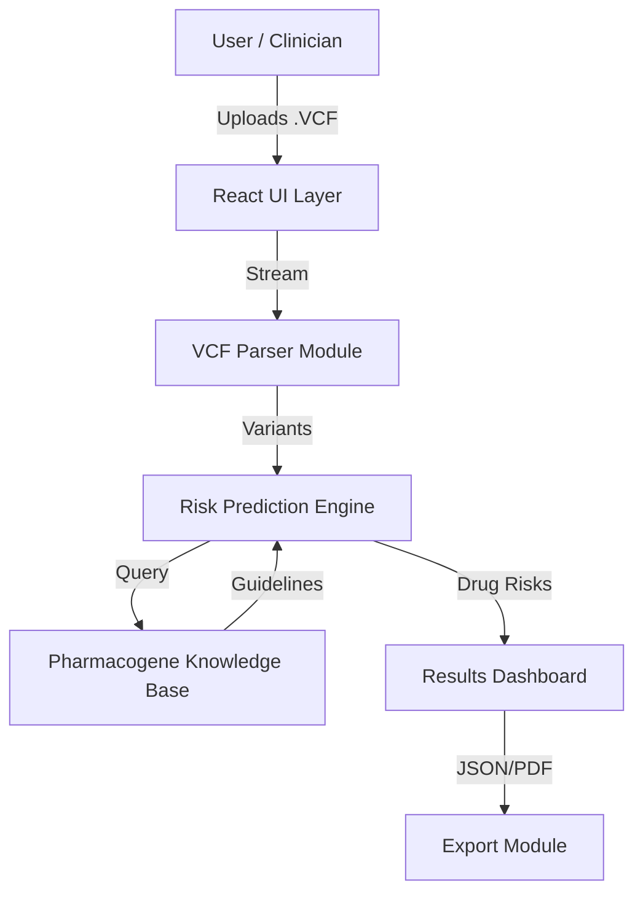

# PharmaGuard: Precision Medicine AI


> **Empowering clinicians and patients with genomic-driven medication safety.**

[](https://pharmaguard.vercel.app/)
[](LICENSE)
[](https://devpost.com)

## 🏥 Overview

**PharmaGuard** is a next-generation Pharmacogenomic (PGx) Clinical Support System. It bridges the gap between raw genomic data and actionable clinical insights. By analyzing a patient's VCF (Variant Call Format) file, PharmaGuard predicts drug metabolism phenotypes and flags potential adverse drug reactions (ADRs) in real-time.

This platform merges advanced UI/UX principles with a robust client-side ML pipeline to deliver a production-grade healthcare experience.

## ✨ Key Features

- **🧬 Client-Side ML Pipeline**: Securely parses and analyzes VCF genomic files directly in the browser. No sensitive DNA data leaves the user's device.
- **⚡ Instant Risk Assessment**: Maps variants (e.g., *CYP2D6\*4*, *CYP2C19\*2*) to CPIC clinical guidelines.
- **👥 Dual-Mode Interface**: 
  - **Doctor Mode**: Detailed variant evidence, star-alleles, and clinical confidence scores.
  - **Patient Mode**: Simplified "Safe/Caution/Toxic" alerts with actionable next steps.
- **📄 Interactive Reports**: Generate and download comprehensive JSON/PDF analysis reports.
- **🎨 Modern Aesthetics**: Glassmorphic UI details, smooth animations, and responsive design.

## 🏗️ Architecture

PharmaGuard uses a modern client-heavy architecture to ensure privacy and speed.



## 🛠️ Tech Stack

- **Frontend**: React 18, TypeScript, Vite
- **Styling**: Tailwind CSS, Shadcn/UI, Framer Motion
- **State Management**: React Query, React Context
- **Genomic Analysis**: Custom VCF Parser (Client-side), Heuristic Star-Allele Caller
- **Deployment**: Vercel

## 🚀 Getting Started

### Prerequisites
- Node.js 18+
- npm or bun

### Installation

1. **Clone the repository**
   ```bash
   git clone https://github.com/your-username/pharmaguard.git
   cd pharmaguard
   ```

2. **Install dependencies**
   ```bash
   npm install
   ```

3. **Start development server**
   ```bash
   npm run dev
   ```

4. **Build for production**
   ```bash
   npm run build
   ```

## 🧠 ML Pipeline Details

The core logic resides in `src/ml`:

1.  **Ingestion**: `vcfParser.ts` reads standard VCF v4.2 files, filtering for high-impact pharmacogenes (CYP2D6, CYP2C9, CYP2C19, SLCO1B1, VKORC1).
2.  **Feature Engineering**: Variants are mapped to functional effects (e.g., "Loss of Function").
3.  **Phenotyping**: A heuristic algorithm assigns metabolic phenotypes (PM, IM, NM, UM) based on allele combinations.
4.  **Risk Prediction**: Phenotypes are cross-referenced with drug-specific guidelines (e.g., *CYP2D6 PM* + *Codeine* = **Toxic**).

## 🤝 Contributing

This project was built for the Healthcare AI Hackathon. Contributions are welcome!

1.  Fork the Project
2.  Create your Feature Branch (`git checkout -b feature/AmazingFeature`)
3.  Commit your Changes (`git commit -m 'Add some AmazingFeature'`)
4.  Push to the Branch (`git push origin feature/AmazingFeature`)
5.  Open a Pull Request

## 📄 License

Distributed under the MIT License. See `LICENSE` for more information.

---

*Built with ❤️ by the PharmaGuard Team.*