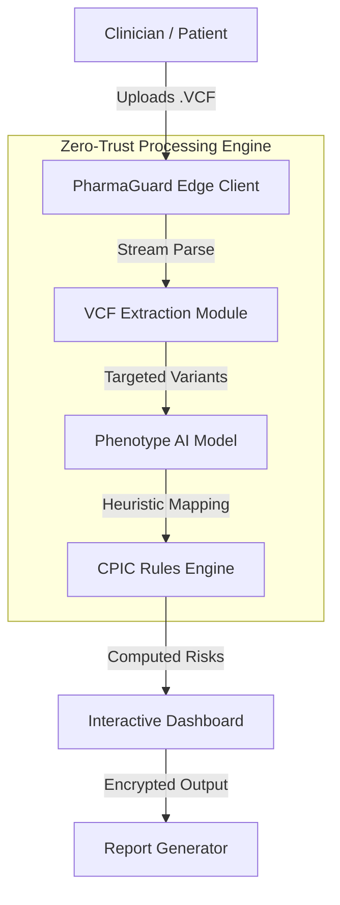

# PharmaGuard Intelligent Pharmacogenomics Platform


> **Enterprise-grade, AI-driven precision medicine at the point of care.**

[](https://pharmaguard.vercel.app/)
[](https://devpost.com)
[](LICENSE)

## 🧬 Overview

**PharmaGuard** is a next-generation Pharmacogenomic (PGx) SaaS platform. We bridge the gap between raw genomic data and actionable clinical insights. Designed for secure, rapid deployment in clinical settings, PharmaGuard ingests patient VCF datasets and delivers intelligent drug safety predictions in real-time.

By shifting advanced machine learning and genomic parsing to the **client-side**, we guarantee zero-trust data privacy—no patient DNA leaves the browser. 

## ✨ Enterprise Features

- **Edge-Computed ML Pipeline**: Parse, filter, and analyze multi-gigabyte VCF files directly within the client environment. Fast, secure, and compliant.
- **Dynamic Risk Engine**: Matches extracted patient variants (e.g., *CYP2D6\*4*) against the latest CPIC clinical guidelines to predict comprehensive Drug-Gene interactions.
- **Adaptive Dashboards**: 
  - **Clinician View**: Granular variant evidence, star-allele breakdowns, and CPIC confidence scores for robust decision-making.
  - **Patient Portal**: Intuitive risk categorization (Safe / Adjust / Toxic) with clear, actionable summaries.
- **Reporting & Export**: Instantly generate structured JSON or PDF compliance reports for EHR integration.
- **Premium UX**: Glassmorphic interfaces, skeleton loaders, and micro-animations designed to reduce cognitive load during critical clinical workflows.

## 🏗️ Technical Architecture

PharmaGuard is engineered for scale, reliability, and security.



## 🛠️ Technology Stack

- **Core**: React 18, TypeScript, Vite
- **Architecture**: Domain-Driven Feature Modules (`/app`, `/features`, `/ml`)
- **Styling**: Tailwind CSS, Framer Motion, Shadcn/UI
- **Data/State**: React Query Contexts
- **Optimization**: Aggressive Rollup Code Splitting (vendor vs ui chunks)

## 🚀 Hackathon Setup & Demo Guide

We've prepared this codebase for seamless demonstration.

### Prerequisites
- Node.js 18+

### Installation & Execution

1. **Clone the repository**
   ```bash
   git clone https://github.com/your-username/pharmaguard.git
   cd pharmaguard
   ```

2. **Install dependencies**
   ```bash
   npm install
   ```

3. **Verify Production Build**
   ```bash
   npm run build
   npm run preview
   ```
   *(We highly recommend verifying the build locally before deploying to Vercel to ensure rollup chunks map correctly).*

4. **Testing the ML Pipeline**
   We have included a test genomic file for the demo.
   - Start the app.
   - Navigate to the upload section.
   - Select `public/demo.vcf`.
   - Watch the edge-pipeline parse the file and predict High-Risk for *Codeine* (based on the synthetic CYP2D6 poor-metabolizer variants).

## 📄 Licensing & Security

Distributed under the MIT License. Built under strict security guidelines for the Healthcare AI Hackathon.
*(Disclaimer: This is a hackathon prototype and not an FDA-approved medical device).*